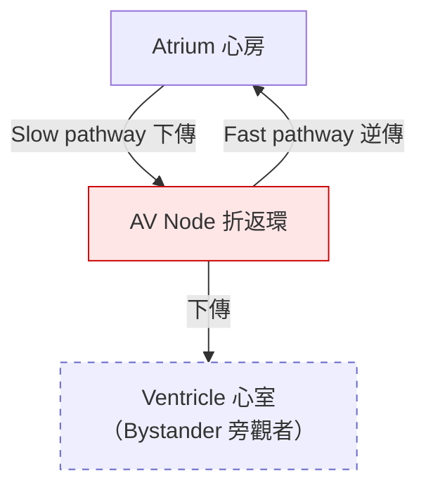
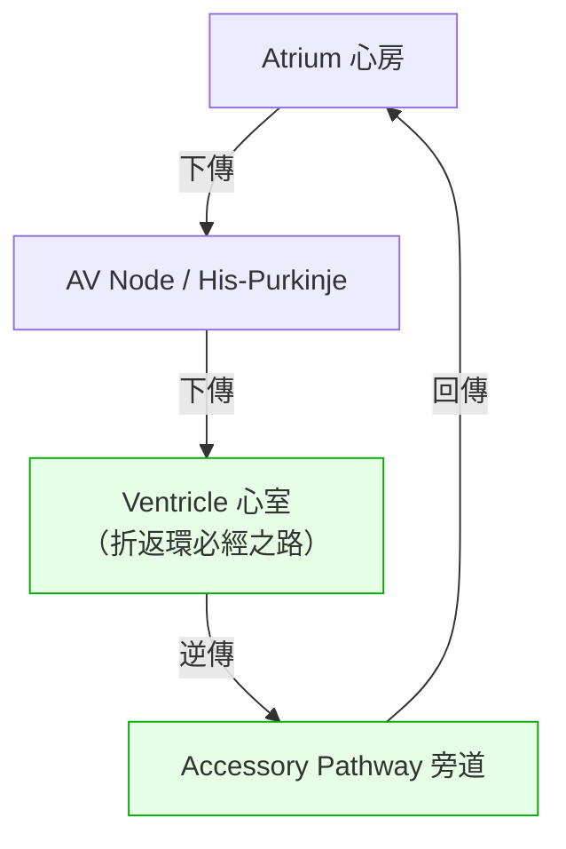
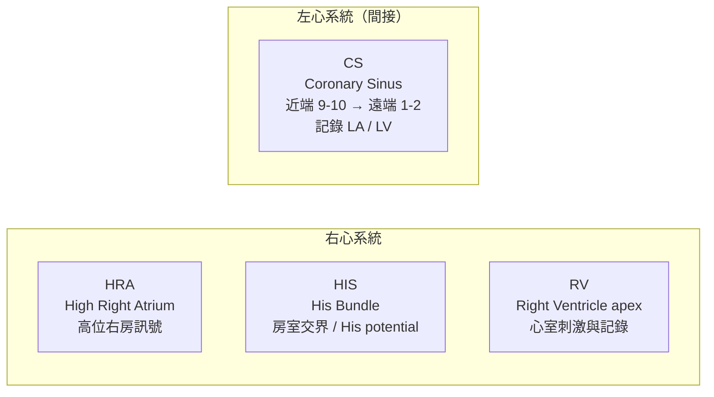
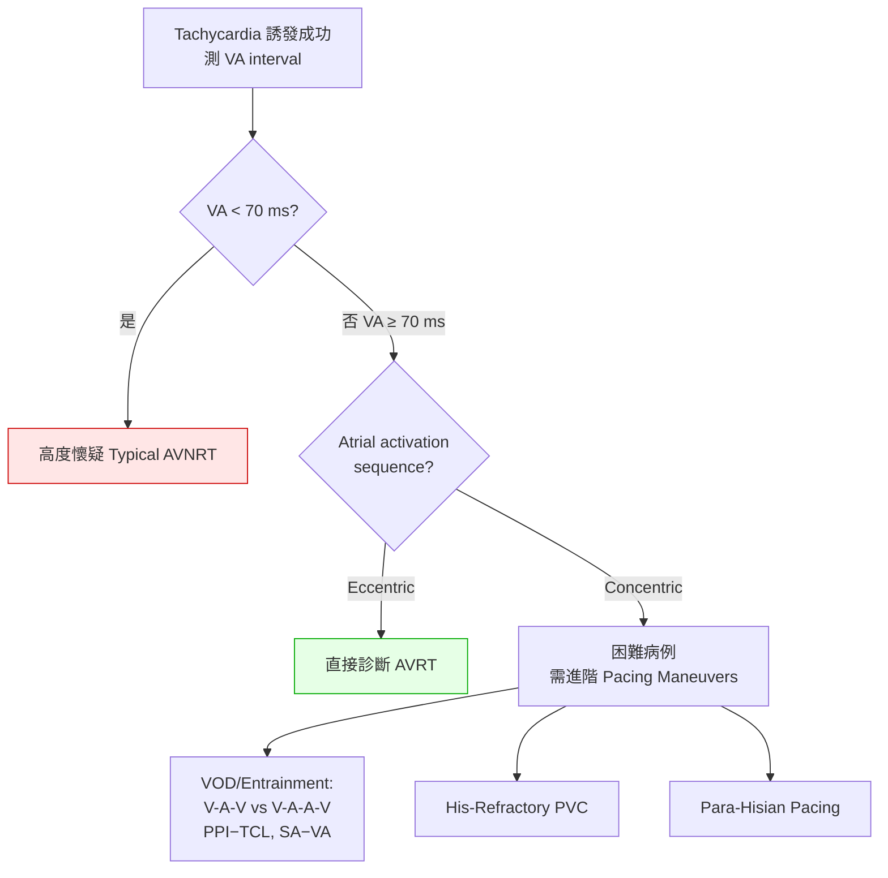

> ⚠️ 這項資訊僅供教學與學術參考，如需醫療建議或診斷，請諮詢專業人士。

# 心臟電生理學筆記：PSVT 中 AVNRT 與 AVRT 的鑑別診斷與 EP Study 完整流程

本文整合了 **陣發性上心室頻脈（Paroxysmal Supraventricular Tachycardia, PSVT）** 兩大主角——**房室結折返性頻脈（Atrioventricular Nodal Reentrant Tachycardia, AVNRT）** 與 **房室折返性頻脈（Atrioventricular Reentrant Tachycardia, AVRT）**——從核心機制、旁道（Accessory Pathway）順向/逆向傳導與 WPW 臨床核心，到 **體表心電圖（Surface ECG）** 與 **電生理檢查（Electrophysiology Study, EP study）** 的鑑別，再到完整的臨床 Workflow。

閱讀地圖：

1. [核心機制與解剖學基礎](#一核心機制與解剖學基礎)
2. [AVNRT 與 AVRT 的亞型細分](#二avnrt-與-avrt-的亞型細分)
3. [深入旁道：順向 vs 逆向傳導與 WPW 的臨床核心](#三深入旁道順向-vs-逆向傳導與-wpw-的臨床核心)
4. [鑑別診斷（一）：Surface ECG](#四鑑別診斷一surface-ecg)
5. [鑑別診斷（二）：EP Study 的實戰鑑別](#五鑑別診斷二ep-study-的實戰鑑別)
6. [基礎間期（Baseline Intervals）完整定義](#六基礎間期baseline-intervals完整定義)
7. [進階 Pacing Maneuvers 深入拆解](#七進階-pacing-maneuvers-深入拆解)
8. [總結鑑別表](#八總結鑑別表)
9. [完整 PSVT Clinical Workflow（7 Phases）](#九完整-psvt-clinical-workflow7-phases)

---

## 一、核心機制與解剖學基礎

在鑑別之前，必須先理解兩者折返環（Reentrant circuit）的物理範圍差異——這是後續**所有** ECG 判讀與 pacing maneuver 的底層邏輯。

| | **AVNRT** | **AVRT** |
| --- | --- | --- |
| 折返環範圍 | **小**，侷限在 AV node 及其周圍心肌 | **大**，橫跨整個房室溝 |
| 折返環組成 | Slow pathway + Fast pathway（Dual AV nodal physiology） | AV node + Ventricle + Accessory pathway (AP) + Atrium |
| 心室（RV）角色 | **旁觀者（Bystander）**，不在折返環上 | **必經之路**，是折返環核心成員 |

> 💡 **記住這句話，整份筆記都通了：**
> AVNRT 的折返環在房室結裡，**心室只是旁觀者**；AVRT 的折返環繞了一大圈，**心室是折返環的一部分**。後面所有 pacing maneuver（PPI−TCL、SA−VA、His-refractory PVC…）本質上都在問同一個問題：**「我從心室塞一個訊號進去，它需不需要多走一段冤枉路（盲端）才能影響心房？」**

### AVNRT 折返環（Typical, Slow-Fast）



激動沿 **Slow pathway** 下傳，幾乎同步沿 **Fast pathway** 逆傳回心房 → 心房與心室**幾乎同時去極化** → VA interval 極短。

### AVRT 折返環（Orthodromic）



激動走 **AV node → 心室 → 旁道 → 心房** 一大圈，心房去極化**必定明顯落後於**心室 → VA interval 較長。

---

## 二、AVNRT 與 AVRT 的亞型細分

### AVNRT 亞型（依 Slow/Fast pathway 的組合與方向）

| 亞型 | 順向（下傳） | 逆傳（上傳） | 電生理特徵 | 佔比 |
| --- | --- | --- | --- | --- |
| **Typical（Slow-Fast）** | Slow pathway | Fast pathway | VA 極短（< 40 ms），逆傳 P 埋在 QRS 內；**Short-RP** | 80–90% |
| **Atypical（Fast-Slow）** | Fast pathway | Slow pathway | 逆傳慢 → 心房明顯落後 → **Long-RP**（VA > 100 ms），逆傳 P 落在下個 QRS 前、II/III/aVF 倒置 | 5–10% |
| **Atypical（Slow-Slow）** | 一條 Slow pathway | 另一條 Slow pathway | VA 介於兩者之間（通常 > 70 ms 但短於 Fast-Slow） | < 5% |

### AVRT 亞型

**A. 依折返環旋轉方向（最核心臨床分類）**

| 亞型 | 路線 | QRS 型態 | 佔比 |
| --- | --- | --- | --- |
| **Orthodromic AVRT** | AV node（下）→ 心室 → 旁道（逆）→ 心房 | **窄 QRS**（除非 aberrancy）；VA ≥ 70 ms | 90–95% |
| **Antidromic AVRT** | 旁道（下）→ 心室 → AV node（逆）→ 心房 | **極寬大畸形 QRS**（Fully pre-excited），急診常誤診為 VT | ~5% |

**B. 依旁道（Accessory Pathway, AP）本身的傳導特性**

- **Manifest AP（顯性旁道）**：具順向傳導能力 → Sinus rhythm 時心室被提早激動 → 體表 ECG 看得到 **Delta wave**（即 WPW syndrome）。
- **Concealed AP（隱匿性旁道）**：**只能逆傳**（心室 → 心房）→ Sinus rhythm 時 ECG 完全正常、無 Delta wave，只在 Orthodromic AVRT 發作時露馬腳。
- **PJRT（Permanent Junctional Reciprocating Tachycardia）**：一種特殊的 concealed AP，多位於 **posterior septum**，逆傳**極慢且 decremental** → 呈 **Long-RP**、常持續發作（Incessant），易導致 **tachycardia-induced cardiomyopathy**。

> 💡 **Long-RP Tachycardia 的鑑別名單（三位在爭）：**
> ① Atypical AVNRT（Fast-Slow）　② PJRT（慢逆傳的 concealed AVRT）　③ AT（Atrial Tachycardia）

---

## 三、深入旁道：順向 vs 逆向傳導與 WPW 的臨床核心

由於 AVRT 完全依賴旁道（Accessory Pathway, AP），在進入鑑別流程前，必須先徹底理解旁道（以及 AV node）的「**順向傳導（Anterograde，心房 → 心室）**」與「**逆向傳導（Retrograde，心室 → 心房）**」。這兩個方向的傳導能力，直接決定了患者的**猝死風險、臨床症狀、心電圖判讀，以及急診用藥的絕對禁忌**——絕非只是名詞上的文字遊戲。

### 1. 什麼是真正的 WPW syndrome？

**WPW syndrome（Wolff-Parkinson-White Syndrome）在醫學定義上，特指具備「順向傳導（Anterograde conduction）」能力的旁道。** 這條旁道解剖上可分布在 left free wall（最常見，二尖瓣環）、right free wall 或 septum，但在生理功能上「必須能夠順向將電訊號從心房傳到心室」，這才是 WPW 定義的靈魂。

#### Sinus rhythm 時：顯性順向旁道的三大 ECG 標誌（Pre-excitation）

訊號繞過 AV node 這個會「踩剎車」的收費站，經旁道搶先傳入心室（pre-excitation），造成三大標誌：

- **PR interval 縮短（< 120 ms）**：訊號走旁道捷徑，跳過 AV node 的減速。
- **Delta wave（δ wave）**：部分心室肌被旁道提早去極化，在 QRS 起始段拉出一個緩升斜坡。
- **QRS 增寬（> 120 ms）**：正常傳導與旁道下傳的訊號在心室內發生 fusion。


> 💡 **對比 Concealed AP（隱匿性旁道）：** 若旁道**只能逆傳**（心室 → 心房）、完全無法順傳，sinus rhythm 時訊號無法經旁道到心室 → **靜態 ECG 完全正常（沒有 Delta wave、PR 正常）**。這種旁道引起的折返雖也會導致頻脈，但臨床上**不稱為 WPW**。
> （這與 baseline HV interval 互相呼應：Manifest AP 因心室被提早激動，常使 **HV < 35 ms 甚至為負值**，見[第六章](#六基礎間期baseline-intervals完整定義)。）

#### 發作 AVRT 時：最常走 Orthodromic

即使 WPW 旁道本身具雙向傳導能力，發作時仍有 **90–95% 走 Orthodromic AVRT**（下傳走 AV node–His-Purkinje、逆傳走旁道）→ 呈**窄 QRS**，且平時看得到的 Delta wave 在發作期間反而暫時消失。只有約 **5% 走 Antidromic AVRT**（下傳走旁道、逆傳走 AV node）→ 呈**極度寬大畸形 QRS（fully pre-excited）**，在急診極易被誤診為 VT。（完整分類見[第二章](#二avnrt-與-avrt-的亞型細分)。）


### 2. 區分順向 vs 逆向傳導的四大臨床意義

**① 決定「致命性猝死風險」的高低（最關鍵指標）**

旁道是否具備**順向傳導（心房 → 心室）**能力，是評估猝死的黃金指標：

- **Concealed AP（僅逆傳）**：萬一發生 **Afib**，心房每分鐘 350–600 下的混亂訊號**完全無法**經旁道下傳，只能走具濾波/限速功能的 AV node → 心室率頂多 100–150 → 猝死風險極低。
- **Manifest AP / WPW（具順傳）**：旁道無限速功能、不應期常很短。一旦 **WPW + Afib**，心房高達 ~400 下的訊號毫無阻攔地經旁道灌入心室 → 心室率狂飆 250–300 → 可瞬間惡化為 **VF（心臟驟停）而猝死**。

> 只要靜態 ECG 看到 Delta wave（代表具順向傳導），臨床上就必須高度警惕其 Afib 誘發 VT/VF 的潛在致命風險。

**② 決定發作時的 ECG 外觀（寬 vs 窄 QRS）**

| AVRT 類型 | 電訊號路線 | ECG 表現與臨床特性 |
| --- | --- | --- |
| **Orthodromic** | AV node（順）→ 心室 → 旁道（逆）→ 心房 | **窄 QRS**，相對穩定的 PSVT，急診處置較有餘裕 |
| **Antidromic** | 旁道（順）→ 心室 → AV node（逆）→ 心房 | **極度寬大畸形 QRS**，難與 VT 區分，常需直接 synchronized cardioversion |

**③ 急診用藥的絕對禁忌（Contraindications）**

當呈現 **pre-excited、寬 QRS 的不規則頻脈（如 WPW + Afib）**，代表心房訊號正經順向旁道大量衝向心室：

- ⚠️ **絕對禁用 AV nodal blockers**：Verapamil、Diltiazem、Digoxin、Beta-blockers，有時甚至包括 Adenosine。
- **致命原因**：這些藥把 AV node 完全鎖死 → 原本走 AV node 的訊號全被逼往那條無限速的順向旁道 → 心室率瞬間從 180 飆破 300 → **當場推入 VF 的死亡深淵**。
- **正確處置**：給予阻斷旁道傳導的藥物（**Procainamide、Amiodarone**）或直接 **synchronized cardioversion**。
- 此原則直接呼應 [Phase 1 急性期處置](#phase-1pre-procedural-clinical-phase診間與急診處置)。

**④ Ablation mapping 的導引依據**

- 尋找**順向**旁道的心室端出口：從心房進行 **Atrial pacing**，觀察最早心室激動（V 波）的位置 → 通常是電燒最核心目標。
- 尋找**逆向**旁道的心房端入口：從心室進行 **Ventricular pacing**，觀察最早逆傳心房激動（A 波）的位置 → 成為精準消融點。
- 實作見 [Phase 5 路線 B](#phase-5target-mapping--catheter-ablation)。

> 💡 **核心臨床邏輯總結：**
> - **順向傳導（Anterograde）** 決定：平時有無 Delta wave、pre-excited Afib 的猝死風險、發作是否呈致命寬 QRS ——是評估**安全性與藥物禁忌**的關鍵指標。
> - **逆向傳導（Retrograde）** 決定：會不會發作最常見的窄 QRS Orthodromic AVRT ——是折返環周而復始不可或缺的「回程線路」，也是手術標測消融的重要依據。

---

## 四、鑑別診斷（一）：Surface ECG

進導管室之前，Surface ECG 已能提供高準確度線索。核心觀察點：**RP interval 長短** 與 **Retrograde P wave 型態**。

### 1. RP Interval 的長短（Short-RP vs. Long-RP）

```
Typical AVNRT (Short-RP, RP < 70 ms)
   R          R          R
   |          |          |
   █  p'      █  p'      █          ← 逆傳 P 埋在 QRS 內或緊跟其後
   |<>|                              RP 極短
   └── 心房與心室幾乎同時去極化

Orthodromic AVRT (Long-RP-ish, RP ≥ 70 ms)
   R              R              R
   |    p         |    p         |
   █    ⌒         █    ⌒         █   ← P 與 QRS 明顯分開
   |<-->|                            RP 較長（走一大圈需要時間）
```

- **Typical AVNRT**：下傳（Slow）與逆傳（Fast）幾乎同步 → 心房、心室同時去極化 → **RP < 70 ms**，逆傳 P 埋在 QRS 裡或緊跟在後。
- **Orthodromic AVRT**：必須先下傳到心室、再經旁道逆傳回心房 → 心房明顯落後 → **RP ≥ 70 ms**，P 與 QRS 分得較開。

### 2. Retrograde P Wave 的特定型態

| 徵象 | 出現導程 | 意義 |
| --- | --- | --- |
| **Pseudo-R' wave** | V1 | QRS 末端多出一個小 R'，若對比平時 sinus rhythm 才新出現 → 高度暗示 **AVNRT** |
| **Pseudo-S wave** | Inferior leads（II, III, aVF） | QRS 末端出現假 S 波（向下小倒置）→ 逆傳 P，暗示 **AVNRT** |
| **Eccentric atrial activation** | I 或 aVL 的 P 倒置 | 心房逆傳從**左側**開始（Left-sided AP）→ **直接排除 typical AVNRT** |

> 💡 Typical AVNRT 的心房逆傳**必定最先到達 interatrial septum**（concentric）。若 P wave 在 Lead I / aVL 倒置，代表左側先激動，這與 typical AVNRT 的生理不相容。

---

## 五、鑑別診斷（二）：EP Study 的實戰鑑別

### 1. 導管放置位置（Catheter Placement）

標準 PSVT 檢查放置四根 multielectrode catheters，記錄 intracardiac electrogram (EGM)：



| 導管 | 位置 | 用途 |
| --- | --- | --- |
| **HRA** | 右心房上部、近 sinus node | 記錄高位右房電訊號 |
| **HIS** | Tricuspid valve septal leaflet 附近 | 捕捉 **His bundle potential** |
| **CS** | 冠狀竇內，近端（9-10）→ 遠端（1-2） | 監測左心房 / 左心室訊號 |
| **RV** | 右心室尖端（RV apex） | 心室刺激與記錄 |

### 2. Tachycardia 中的基礎心內電圖特徵

引發 tachycardia 後，先測 **VA interval**（心室訊號起始 → 最早心房訊號起始）：

| VA interval | 判讀 |
| --- | --- |
| **< 70 ms**（常 < 40 ms） | 高度支持 **Typical AVNRT** |
| **> 70 ms** | 支持 **AVRT** 或 **Atypical AVNRT (Fast-Slow)** |

再觀察 **Atrial activation sequence（心房激動順序）**：

```
Concentric activation（中隔最早）        Eccentric activation（偏離中隔）
   HRA   ────┐                             HRA   ──── (早) ← Right free-wall AP
   HIS(A)────┼── 最早在此（Septum）         HIS(A)────
   CS prox───┘                             CS prox───
   CS dist───                              CS dist──── (早) ← Left free-wall AP
   → AVNRT 或 Septal-AP AVRT                → 直接診斷 AVRT（排除 typical AVNRT）
```

- **Concentric**：最早心房激動在 **septal region**（HIS 的 A 波或 CS 近端）→ 可見於 AVNRT **或** septal AP 的 AVRT。
- **Eccentric**：最早心房激動**偏離中隔**（CS 遠端 = Left free-wall AP；HRA = Right free-wall AP）→ **一旦發現即排除 typical AVNRT，直接診斷 AVRT**。

#### 鑑別診斷主流程圖



---

## 六、基礎間期（Baseline Intervals）完整定義

這三個 baseline intervals **必須在 Sinus rhythm（自發心律、完全無 pacing）下測量**——因為它們評估的是「訊號的生理傳導時間」，一旦 pacing 就會改變激動起點與方向，量到的就不是生理間期了。

電氣訊號像大隊接力由上往下傳：

```
體表 P 波起始 ──PA──▶ HRA 的 A 波 ─▶ His 的 A 波 ──AH──▶ His potential(H) ──HV──▶ 心室 V
```

| 間期 | 起點（From） | 終點（To） | 生理意義 | 正常值 |
| --- | --- | --- | --- | --- |
| **PA interval** | 體表 ECG（Lead II）P wave **起始點** | HRA 導管最早 A 波偏轉點 | 心房內傳導時間（SA node → 高位右房心肌） | **20–40 ms** |
| **AH interval** | HIS 導管的 **A 波**起始點 | HIS 導管的 **His potential (H)** 起始偏轉點 | 通過 **AV node** 的傳導時間；評估 dual AV nodal physiology 的最重要指標 | **60–125 ms**（受自主神經影響大） |
| **HV interval** | HIS 導管的 **H 波**起始點 | 體表 QRS 起始點（或 HIS/RV 最早 V 波） | 通過 **His-Purkinje system** 到心室去極化的時間 | **35–55 ms** |

> 💡 **教學亮點：** 若 **HV < 35 ms 甚至為負值**（體表 QRS 比 H 波還早出現），代表心室被異常路徑提早激動 → 強烈暗示 **Manifest accessory pathway（WPW syndrome）**。

**為什麼不能用 pacing 量 PA？**
Atrial pacing 的激動起點就是導管位置，會改變心房去極化方向 → 量到的變成 stimulus-to-atrial 時間；Ventricular pacing 是由下往上逆傳，更不可能用來量順向的 PA。所以三者都必須在 sinus rhythm 下量。

---

## 七、進階 Pacing Maneuvers 深入拆解

對於 **concentric activation 且 VA > 70 ms** 的困難病例，用以下經典手法一錘定音。

### 手法 A：Ventricular Overdrive Pacing (VOD) / Entrainment

**用什麼 pacing？** 從 **RV apex** 導管，以比 **Tachycardia Cycle Length (TCL)** 短約 **10–20 ms** 的速率連續起搏（例：TCL = 400 ms → 用 380 ms 連打 8–10 beats），去「帶動（Entrain）」整個折返環，讓折返環跟著 pacing 節奏走。停止起搏後讀取三個指標：

#### ① 停止起搏後的反應：V-A-V vs V-A-A-V

```
V-A-V response（AVNRT 與 AVRT 皆可）
  ...pacing... | V — A — V(自發)
                 停止起搏後：室 → 房 → 室

V-A-A-V response（直接證實 AVNRT）
  ...pacing... | V — A — A — V(自發)
                 連續兩個 A 才出現 V
                 → 激動在 AV node 內折返，上傳心房與下傳心室發生解耦
```

- **V-A-V**：心房是折返環的一部分 → AVNRT / AVRT 皆可能。
- **V-A-A-V**：**直接證實 AVNRT**。

#### ② PPI − TCL（Post-Pacing Interval − Tachycardia Cycle Length）

**PPI** = 停止起搏那一瞬間，RV 導管上記錄到**第一個自發性 V 波**的時間間隔——想像成訊號的「折返跑一圈時間」：最後一個 pacing beat 從 RV 出發 → 進折返環繞一圈 → 回到 RV。

```
核心問題：RV 是不是在折返環的「必經之路」上？

AVRT：RV 就在跑道上 ──▶ 不用多走冤枉路 ──▶ PPI ≈ TCL
       ┌─────────── 折返環 ───────────┐
       │  RV(起搏點就在環上) → AP → A → AVN → V  │
       └───────────────────────────────┘
       PPI − TCL < 115 ms（常 < 70 ms）

AVNRT：RV 在跑道外（bystander）──▶ 進出都要走盲端 ──▶ PPI ≫ TCL
       RV ──盲端──▶【AVN 折返環】──盲端──▶ RV
       PPI − TCL > 115 ms
```

| PPI − TCL | 判讀 |
| --- | --- |
| **< 115 ms** | **AVRT**（RV 在折返環上，訊號直接融入繞一圈回來） |
| **> 115 ms** | **AVNRT**（折返環在 AV node，RV 只是旁觀者，來回多走盲端） |

#### ③ SA − VA（Stimulus-to-Atrial − Ventricular-to-Atrial）

同樣在 VOD 過程中測量，但**不需等停止起搏**：

- **SA interval（起搏當下）**：RV 發出 stimulus → 逆傳到最早心房波的時間。
- **VA interval（原本頻脈時）**：未起搏時，心室波 → 逆傳心房波的時間。

```
邏輯依舊：RV 到心房，需不需要多走盲端？

AVRT：起搏走的路徑 ≈ 頻脈走旁道的路徑 → SA ≈ VA → 差值小
      SA − VA < 85 ms

AVNRT：SA 需先穿心室肌、爬 His-Purkinje 才進 AVN → SA 被大幅拉長
      SA − VA > 85 ms
```

| SA − VA | 判讀 |
| --- | --- |
| **< 85 ms** | **AVRT** |
| **> 85 ms** | **AVNRT** |

> 💡 **PPI−TCL 與 SA−VA 講的是同一個故事：** 「我從 RV 塞訊號進去，要不要多走一段**冤枉路（盲端 / bystander pathway）**才能到心房？」
> **AVRT** RV 在環上 → 不走冤枉路 → 差值都**小**。**AVNRT** RV 在環外 → 進出走盲端 → 差值都**大**。

### 手法 B：His-Refractory PVC（His 束不應期室性早搏）

**最優雅、最具決定性的手法。** 在 tachycardia 過程中，趁 His bundle 剛好處於**絕對不應期（absolute refractory period）** 時，從心室給一個單發早搏（PVC）。

```
時機：His 已被順向激動、正處不應期時 ──▶ 打一個 PVC

結果 1：PVC 能 Advance（提前）/ Delay（延後）下一個 A 波，或直接 Terminate 頻脈
        （此時 His 根本還沒重新激動）
        → 訊號不需經 His-Purkinje 就能跨房室溝到心房
        → 100% 證實有 Accessory Pathway ══▶ AVRT ✅

結果 2：PVC 對接下來的心房激動「完全沒有影響」（No effect）
        → 順向的 His 阻擋了 PVC 逆傳
        → 支持 AVNRT
```

### 手法 C：Para-Hisian Pacing（旁 His 束起搏）

在 **Sinus rhythm（非頻脈）** 下進行，將起搏導管固定在 His bundle 旁，調整輸出電壓，觀察 **Stimulus-to-Atrial (S-A) interval** 變化：

```
High output ──▶ 同時 capture RV 心肌 + His bundle ──▶ 窄 QRS
Low output  ──▶ 僅 capture RV 心肌（失去 His capture）──▶ 寬 QRS

失去 His capture（QRS 變寬）時，看 S-A 怎麼變：

AV Node 傳導（AVNRT）：激動改由心室肌慢慢爬到 AVN 再逆傳
                       → S-A 明顯【延長】
Septal AP（AVRT）    ：不論有無 His capture，都直接走中隔旁 AP 逆傳
                       → S-A【保持不變】（變化 < 10 ms）
```

| 失去 His capture 時 S-A | 判讀 |
| --- | --- |
| **明顯延長** | **AVNRT**（走 AV node） |
| **保持不變（< 10 ms）** | **AVRT**（走 Septal AP） |

---

## 八、總結鑑別表

| 鑑別項目 | **AVNRT (Typical)** | **AVRT (Orthodromic)** |
| --- | --- | --- |
| **Surface ECG RP interval** | 短（< 70 ms），常見 Pseudo-R' / Pseudo-S | 較長（≥ 70 ms） |
| **Atrial Activation Sequence** | **必定 Concentric** | 可 Eccentric（Left/Right AP）或 Concentric（Septal AP） |
| **Baseline VA interval** | < 70 ms（常 < 40 ms） | > 70 ms |
| **PPI − TCL** | > 115 ms | < 115 ms |
| **SA − VA** | > 85 ms | < 85 ms |
| **VOD 停止後反應** | 可見 V-A-A-V | V-A-V |
| **His-Refractory PVC** | No effect | 能 Reset（Advance/Delay）或 Terminate 頻脈 |
| **Para-Hisian Pacing** | 失去 His capture 時 S-A 顯著延長 | 失去 His capture 時 S-A 保持不變 |

透過這套從**體表到心內、從動態觀察到主動起搏施壓**的標準流程，即可以極高精準度將 AVNRT 與 AVRT 完全鑑別，進而執行精準的 **Catheter Ablation**。

---

## 九、完整 PSVT Clinical Workflow（7 Phases）

從病患入院、進導管室、EP study、消融到術後照護的完整標準臨床流程，依時間軸劃分為 7 個 Phases。


### Phase 1：Pre-Procedural Clinical Phase（診間與急診處置）

**1. 急性期發作處置（Acute Termination）** — Surface ECG 證實 Regular narrow QRS tachycardia：

- **Hemodynamically Unstable**（低血壓、意識不清、嚴重胸痛、急性肺水腫）→ 立刻 **Synchronized DC Cardioversion**。
- **Hemodynamically Stable**：
  1. 第一線：**Vagal maneuvers**（Modified Valsalva / Carotid sinus massage）。
  2. 第二線：**Adenosine IV rapid bolus**（6 mg → 無效則 12 mg）；給藥時**連續記錄 ECG**，觀察是「走 A 終止」還是「走 V 終止」（對後續診斷極有幫助）。
  3. 第三線：Adenosine 禁忌 / 無效 → **Calcium channel blockers**（Verapamil / Diltiazem）或 **Beta-blockers**。

> ⚠️ **例外警示：** 若為 **pre-excited、寬 QRS 的不規則頻脈（WPW + Afib）**，**絕對禁用 AV nodal blockers**（含 Adenosine），否則可能誘發 VF；改用 Procainamide/Amiodarone 或直接電擊。原理詳見[第三章 §2 ③](#三深入旁道順向-vs-逆向傳導與-wpw-的臨床核心)。

**2. 術前評估與準備（Pre-Op Evaluation）**

- **Baseline ECG Review**：恢復 sinus rhythm 後看有無 **Delta wave** → 有 = WPW（Manifest AVRT）；無 = AVNRT 或 Concealed AVRT。
- **AAD Washout**：術前停用抗心律不整 / 心率控制藥（Beta-blockers、CCBs、Amiodarone…）至少 **5 個半衰期**，避免掩蓋電生理特性。
- **Informed Consent** + **NPO 6–8 小時**（解釋 AV block、血管併發症、cardiac tamponade 等風險）。

### Phase 2：EP Lab Setup & Baseline Catheterization

1. **麻醉**：平躺、接 12-lead ECG + defibrillator pads；Conscious sedation（Midazolam / Fentanyl）+ 雙側 groin 局麻。
2. **血管通路**：常規 **Right femoral vein** 放 3–4 個 sheaths（6F/7F）；CS 若股靜脈困難可加 Right IJ 或 Left subclavian。
3. **導管定位**（Fluoroscopy 或 3D mapping 引導）：HRA、HIS、RV apex、CS（見[第五章 §1 導管放置位置](#1-導管放置位置catheter-placement)）。
4. **Baseline Intervals**（Sinus rhythm 下）：測 PA / AH / HV（見[第六章](#六基礎間期baseline-intervals完整定義)）。

### Phase 3：Diagnostic Stimulation & Induction

**目標：測試 AV node 與旁道傳導特性，並嘗試誘發頻脈。**

1. **Programmed Atrial Stimulation**
   - **Incremental Atrial Pacing (Decremental)**：逐漸加快，看 AH 是否漸長 → 測 **AV node Wenckebach cycle length**。
   - **Atrial Extrastimulus (S1-S2)**：8 個 S1 後給提早的 S2，每次提早 10 ms 直到 refractory。
   - **尋找 "AH Jump"**：某個 coupling interval 下 AH **突然延長 ≥ 50 ms** → 證實 **Dual AV nodal physiology**（S2 撞到 fast pathway 不應期，改走 slow pathway）→ 常直接誘發 typical AVNRT。
2. **Programmed Ventricular Stimulation**
   - **Incremental Ventricular Pacing**（RV apex）看逆傳特性：
     - **Decremental / Concentric**（起搏愈快 VA 愈長、最早 A 在 HIS 或 CS 近端）→ 走 AV node 逆傳。
     - **Non-decremental / Eccentric**（VA 固定不變，或最早 A 在 CS 遠端）→ **100% 證實有 AP**。
   - **Ventricular Extrastimulus (S1-S2)**：找 retrograde effective refractory period (RERP)。
3. **Pharmacological Provocation**：常規 pacing 無法誘發 → 滴注 **Isoproterenol（1–4 mcg/min）** 提高心率 20–30% 後重做上述流程。

### Phase 4：Intra-Procedural Differential Diagnosis

頻脈穩定維持後，進入核心鑑別（見[第五章](#五鑑別診斷二ep-study-的實戰鑑別)與[鑑別診斷主流程圖](#鑑別診斷主流程圖)）：

1. 測 **TCL** 與 **VA**：VA < 70 → 疑 typical AVNRT；VA ≥ 70 → 納入 AVRT / atypical AVNRT。
2. 判 **Atrial activation sequence**：Eccentric → 直接 AVRT；Concentric → 續做進階手法。
3. **進階 Pacing Maneuvers**：VOD（PPI−TCL、V-A-V vs V-A-A-V、SA−VA）、His-Refractory PVC。

### Phase 5：Target Mapping & Catheter Ablation

確診後將一根導管換成 **Ablation catheter**，執行 **RF ablation** 或 **Cryoablation**。

**路線 A：AVNRT → Slow Pathway Ablation**

- **解剖定位**：靶點位於 **Koch's triangle**（Tendon of Todaro、Tricuspid septal leaflet、Coronary sinus ostium [CS os] 三者圍成）。
- **電氣定位**：消融導管置於 CS os 上緣 / 前上緣（posterior septum），找 **slow pathway potential**；理想靶點 EGM 呈 **小 A 波、大 V 波（Low A:V ratio）**。
- **RF Delivery**：溫度 55–60°C、功率 30–50W。
  - **重要指標**：成功加熱 slow pathway 會引發 **Accelerated junctional rhythm**；此時須緊盯螢幕，確認**每個 junctional beat 後都有 1:1 逆傳 A 波**。
  - ⚠️ **安全警戒**：一旦出現 **VA dissociation** 或 **PR 突然延長**，須在 **1 秒內立刻停止放電**，以防永久性 **Complete AV block**（否則需裝永久性 pacemaker）。

**路線 B：AVRT → Accessory Pathway Ablation**

- **Manifest AP（有預激）**：Sinus rhythm / atrial pacing 下 mapping，找 **earliest ventricular activation**（消融導管 V 波比體表 Delta wave 更早，A 與 V 幾乎融合 = AV fusion）。
- **Concealed AP（無預激）**：Tachycardia / ventricular pacing 下 mapping，找 **earliest retrograde atrial activation**（哪個 CS 或右房電極 A 波最早）。
- **RF Delivery**：放電成功通常 2–5 秒內體表 **Delta wave 瞬間消失**（Manifest），或 **tachycardia 瞬間終止且房室分離**（Concealed）；隨後補滿 60–90 秒鞏固放電。

### Phase 6：Post-Ablation Confirmation & Endpoints

消融成功後**不可立即拔管**，須通過嚴格科學驗證：

- **Waiting Period**：靜置觀察 **20–30 分鐘**，確保燒灼組織無缺血恢復（recovery）。
- **重做 Induction Protocol（加 Isoproterenol）**：
  - **AVNRT 終點**：頻脈無法再誘發、slow pathway 傳導消失，或至多只允許出現**一個 atrial echo beat**（不伴 jump）。
  - **AVRT 終點**：證實 **Bidirectional block**（旁道雙向阻滯）——Antegrade 無 Delta wave；Retrograde 傳導變回典型 **decremental 且 concentric**（走回 AV node）。

### Phase 7：Hemostasis & Post-Procedural Care

- **拔管與止血**：拉出所有導管；股靜脈 sheaths 直接拔除，**Manual compression 15–20 分鐘**，或用 **Figure-of-eight suture（八字縫合）** 緊密止血。
- **術後病房照護**：**Bed rest 4–6 小時**，術側大腿保持伸直，避免 hematoma / pseudoaneurysm；**Telemetry** 監測心動過緩、AV block、頻脈復發。
- **出院衛教**：無併發症通常隔天出院；左心系統（Left-sided AP）經主動脈逆行消融者，出院後常處方 **低劑量 Aspirin 1–3 個月**預防血栓；衛教一週內避免提重物與劇烈運動，定期回診。

---

## 附錄：核心邏輯一句話總結

- **旁道方向**：**順向傳導（Anterograde）** 決定猝死風險與藥物禁忌（Delta wave、WPW + Afib → VF）；**逆向傳導（Retrograde）** 決定會不會發作窄 QRS Orthodromic AVRT，也是消融標測依據。
- **Surface ECG**：先看 **RP interval**（短 = AVNRT / 長 = AVRT）與逆傳 P 型態（Pseudo-R'/S、Lead I 倒置）。
- **EP Study**：VA < 70 ms 傾向 AVNRT；**Eccentric activation 直接 = AVRT**。
- **困難病例的靈魂拷問**：「從 RV 塞訊號進去，要不要多走**冤枉路（盲端）**才到心房？」
  - **AVRT** RV 在環上 → 不走冤枉路 → **PPI−TCL < 115、SA−VA < 85、His-Refractory PVC 能 reset**。
  - **AVNRT** RV 在環外 → 進出走盲端 → **PPI−TCL > 115、SA−VA > 85、His-Refractory PVC 無效、Para-Hisian 失 His capture 時 S-A 延長**。
